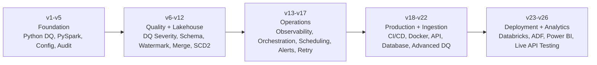

# End-to-End Data Engineering Pipeline Simulator

This project is a portfolio-ready Data Engineering pipeline simulator built with Python, PySpark, Delta Lake, Docker, API ingestion, database ingestion, advanced data quality, Databricks deployment metadata, Azure Data Factory-style orchestration metadata, Power BI-ready observability outputs, CI/CD gates, and production-style framework patterns.

It demonstrates how customer data can be extracted from API-style and database-style sources, landed into raw storage, validated through metadata-driven DQ rules, quarantined, transformed into a canonical model, historically tracked using SCD Type 2, observed through pipeline metrics, protected with alerting and retry controls, organized for Databricks and ADF-style deployment, exported into Power BI-ready dashboard datasets, and verified through automated release gates.

```text
Current Version: v25.0.1
```

---

## Interviewer Review Snapshot

This project is designed to show production-style Data Engineering thinking, not only basic transformation code.

| Review Area | What This Project Demonstrates |
|---|---|
| Role alignment | Azure / Databricks / PySpark Data Engineering pipeline design |
| End-to-end system thinking | Source ingestion -> raw landing -> bronze -> silver -> gold -> downstream MDM-style output |
| Production controls | Schema validation, DQ rules, quarantine, audit, alerting, SLA monitoring, retry, replay, CI/CD, Docker |
| Versioned engineering maturity | The project evolved from foundation pipelines to observability, orchestration, deployment, and dashboard readiness |
| Real-work alignment | Mirrors Apexon / IQVIA-style MDM ingestion, DQ, canonical modeling, and JSON payload generation patterns |

---

## End-to-End Flow

```mermaid
flowchart LR
    A[Source Systems<br/>API / File / Database] --> B[Raw Landing<br/>JSON / CSV / Tables]
    B --> C[Schema Contracts<br/>Required Fields + Types]
    C --> D[Bronze Layer<br/>Standardization]
    D --> E[Data Quality Framework<br/>Rules + Severity]
    E --> F{Valid?}
    F -- Yes --> G[Silver Layer<br/>Clean + Transformed Data]
    F -- No --> H[Quarantine Layer<br/>Rejected Records]
    G --> I[Gold Layer<br/>Canonical Model]
    I --> J[SCD Type 2<br/>History Tracking]
    J --> K[Reltio-style<br/>JSON Payloads]
    K --> L[Audit + Run Metadata]
    L --> M[Observability Metrics]
    M --> N[Alerts + SLA Monitoring]
    N --> O[Retry / Recovery / Replay]
    O --> P[CI/CD + Release Verification]
    P --> Q[Docker + Databricks / ADF-style Deployment]
    Q --> R[Power BI-ready Outputs]
```



### What this flow proves

- I can design pipelines beyond simple ETL scripts.
- I understand ingestion, schema validation, data quality, quarantine, canonical modeling, and downstream integration.
- I can add production controls such as audit metadata, observability, alerting, retry/recovery, release gates, and CI/CD.
- I can explain a complete source-to-consumption pipeline in interview discussions.

---

## Versioned Project Maturity



| Version Range | Engineering Maturity Added | What It Proves |
|---|---|---|
| v1 - v5 | Config-driven Python pipeline, PySpark medallion flow, Databricks-style structure, centralized config, audit tracking | Strong foundation and clean project structure |
| v6 - v12 | Severity-based DQ, custom exceptions, schema validation, incremental load, watermarking, merge/upsert, SCD Type 2 | Data quality, reliability, and lakehouse processing depth |
| v13 - v17 | Observability mart, orchestration, job control, scheduling, dependency checks, alerting, SLA monitoring, retry and replay | Operational thinking beyond basic transformation code |
| v18 - v22 | CI/CD hardening, Docker runtime, API ingestion, database ingestion, advanced DQ rule catalog | Production-readiness, testability, and ingestion framework design |
| v23 - v26 | Databricks Asset Bundle-style structure, Azure Data Factory simulation, Power BI observability, planned live public API integration | Cloud deployment style, analytics visibility, and real-world integration practice |

---

## Real-Work Alignment

This project is connected to real Apexon / IQVIA-style MDM Data Engineering scenarios.

| Real Work Pattern | Portfolio Implementation |
|---|---|
| API, file, connector, and system source ingestion | Config-driven API/database ingestion and raw landing |
| Landing to staging and business-rule transformations | Bronze and Silver processing with schema and DQ checks |
| Data quality failures and quarantine handling | Severity-based DQ framework with clean/quarantine split |
| Canonical modeling for downstream systems | Gold canonical layer and Reltio-style JSON payload generation |
| Incremental processing and error triage | Watermarks, audit logs, retry/recovery, failure replay, SLA monitoring |
| Production release discipline | CI/CD gates, release verification, Docker, repo hygiene, runtime cleanliness checks |

---

## Project Versions

| Version | Feature |
|---|---|
| v0.0.0 | Project foundation and local repository setup |
| v1.0.0 | Python config-driven DQ pipeline |
| v2.0.0 | PySpark Bronze/Silver/Gold medallion pipeline |
| v3.0.0 | Databricks-style documentation and notebook structure |
| v4.0.0 | Production-style centralized pipeline configuration |
| v5.0.0 | Pipeline audit tracking |
| v6.0.0 | Severity-based DQ failure control |
| v7.0.0 | Custom exceptions and structured error handling |
| v8.0.0 | Schema Validation Framework |
| v9.0.0 | Incremental Load and Watermark Framework |
| v10.0.0 | Delta Lake / Lakehouse Storage Upgrade |
| v11.0.0 | Delta MERGE / Upsert Framework |
| v12.0.0 | SCD Type 2 / Historical Dimension Tracking |
| v13.0.0 | Data Observability + Pipeline Metrics Mart |
| v13.0.1 | Pre-V14 repository review and roadmap handoff cleanup |
| v13.0.2 | Markdown formatting cleanup before V14 |
| v14.0.0 | Pipeline Orchestration + Job Control Framework |
| v15.0.0 | Scheduling, Dependency Management, and Runtime Parameterization |
| v16.0.0 | Pipeline Alerting, Failure Notification, and SLA Monitoring |
| v17.0.0 | Retry Framework, Recovery Handling, and Failure Replay |
| v18.0.0 | CI/CD Hardening, Quality Gates, and Release Automation |
| v19.0.0 | Docker Containerized Local Runtime |
| v20.0.0 | API Ingestion Framework |
| v21.0.0 | Database Ingestion Framework |
| v22.0.0 | Advanced Data Quality Rule Catalog |
| v23.0.0 | Databricks Asset Bundle Style Deployment Structure |
| v23.0.1 | Pre-V24 Professional Repository Cleanup |
| v24.0.0 | Azure Data Factory Orchestration Simulation |
| v25.0.0 | Power BI-Ready Observability Dashboard |
| v25.0.1 | Documentation and Release Gate Alignment |
| v26.0.0 | Planned Live Public API Integration Testing Framework |

---

## Current Architecture

```text
Mock API / SQLite Database / Raw Customer CSV
↓
V20 API Ingestion + V21 Database Ingestion + Raw Landing
↓
V22 Advanced DQ Rule Catalog
↓
Bronze Schema Validation
↓
Incremental Watermark Filter
↓
Bronze Delta Table
↓
Silver Delta Table + Quarantine Delta Table
↓
Customer History SCD2 Delta Table
↓
Gold Canonical Delta Table
↓
Reltio-style JSON Payload
↓
Commit Watermark After Success
↓
Pipeline Audit Update
↓
V13 Observability Metrics Mart
↓
V14 Job Orchestration + Job Control
↓
V15 Runtime Parameters + Dependency Validation
↓
V16 Alerting + SLA Monitoring
↓
V17 Retry + Recovery + Failure Replay
↓
V18 CI/CD Quality Gates + Release Verification
↓
V19 Docker Containerized Runtime
↓
V23 Databricks Asset Bundle Style Deployment Structure
↓
V24 Azure Data Factory Style Orchestration Simulation
↓
V25 Power BI-Ready Observability Dashboard Outputs
```

---

## Planned V26 Phase: Live Public API Integration Testing

V26 will extend the existing V20 API ingestion framework by adding a controlled live-public-API integration testing layer. The old `Public-API` repository will be reused as a supporting integration source registry instead of remaining only as a copied public API README list.

The goal of this phase is to test the pipeline against real HTTP APIs while keeping the main Data Engineering project stable, repeatable, and production-style.

Planned V26 scope:

- Select a small set of stable public APIs for controlled live ingestion tests.
- Build a source registry for API name, endpoint, method, expected status, timeout, retry policy, and expected schema.
- Add a reusable API client with timeout handling, response validation, and structured exceptions.
- Store raw live API responses in a raw landing format.
- Validate JSON response shape using schema contracts.
- Route failed, empty, malformed, or schema-invalid responses to quarantine.
- Normalize valid responses into tabular records for Bronze/Silver processing.
- Capture audit metrics for endpoint status, latency, response size, record count, and failure reason.
- Add unit tests with mocked API responses so CI/CD does not depend on internet availability.
- Add optional manual live integration test execution for local practice and demo purposes.

Planned V26 architecture extension:

```text
Selected Live Public APIs
↓
Public API Source Registry
↓
Live API Client + Timeout/Retry Handling
↓
Raw JSON Landing
↓
Schema Contract Validation
↓
Valid Response Path / Quarantine Path
↓
Bronze + Silver Normalization
↓
Audit + Observability Metrics
↓
Existing Orchestration, Alerting, Retry, CI/CD, and Dashboard Layers
```

V26 will not replace the current mock API ingestion. It will add a realistic integration-testing option that demonstrates how a production Data Engineering pipeline handles live upstream data instability.

Detailed phase document: `docs/roadmap/v26_live_public_api_integration_testing.md`

---

## Features

- Python config-driven DQ pipeline
- PySpark medallion architecture
- Bronze, Silver, Gold, Quarantine, and Customer History layers
- Delta Lake-style local storage support
- Config-driven API ingestion framework
- Config-driven database ingestion framework
- Advanced metadata-driven DQ rule catalog
- Schema validation using JSON contracts
- Incremental load using watermark tracking
- Pending watermark staging to prevent data loss
- Severity-based DQ failure control
- Quarantine handling
- Pipeline audit tracking
- Custom exception handling
- Delta MERGE / Upsert design
- SCD Type 2 history tracking
- Data observability metrics mart
- Power BI-ready observability dashboard exports
- Alerting and SLA monitoring
- Retry, recovery, and replay handling
- Runtime parameterization and dry-run support
- Databricks Asset Bundle-style deployment structure
- Azure Data Factory-style orchestration metadata
- Docker containerized local runtime
- CI/CD quality gates and release verification
- Repository hygiene validation
- Runtime-output cleanliness validation
- Reltio-style JSON payload generation

---

## Key Configuration and Metadata

```text
databricks.yml
resources/customer_medallion_job.yml
azure/adf/pipelines/customer_medallion_adf_pipeline.json
azure/adf/linked_services/ls_databricks_customer_pipeline.json
azure/adf/datasets/customer_landing_metadata.json
dashboards/powerbi/observability_dashboard_schema.json
config/pipeline/local_config.json
config/rules/customer_dq_rules.json
config/rules/advanced_customer_dq_rule_catalog.json
config/api/customer_api_ingestion_config.json
config/database/customer_database_ingestion_config.json
config/jobs/customer_medallion_job.json
config/alerts/customer_medallion_alerts.json
config/retries/customer_medallion_retry_policy.json
configs/schema_contracts/bronze_customers_schema.json
configs/schema_contracts/silver_customers_schema.json
```

---

## How to Run Locally

Activate virtual environment:

```bash
source .venv/bin/activate
```

Install dependencies:

```bash
python -m pip install -r requirements.txt
```

Run dry-run orchestration:

```bash
python -m scripts.pipeline_orchestrator --dry-run --run-date 2026-06-23
```

Run observability collection:

```bash
python -m scripts.pipeline_observability
```

Export Power BI-ready observability files:

```bash
python -m scripts.powerbi_observability_exporter
```

---

## Validation and Release Gates

Run the full current verification set:

```bash
python -m scripts.validate_python_project
python -m scripts.validate_config_files
python -m scripts.validate_docker_artifacts
python -m scripts.validate_databricks_bundle_structure
python -m scripts.validate_repo_hygiene
python -m scripts.validate_adf_artifacts
python -m scripts.validate_powerbi_dashboard_artifacts
python -m unittest tests.test_v24_adf_artifacts
python -m unittest tests.test_v25_powerbi_observability_dashboard
python -m unittest discover tests
python -m scripts.pipeline_orchestrator --dry-run --run-date 2026-06-23
python -m scripts.validate_runtime_cleanliness
```

Run full release verification:

```bash
python -m scripts.release_verification --version v25.0.1
```

Validate release tag safety before tagging:

```bash
python -m scripts.validate_release_tag --version v25.0.1
```
