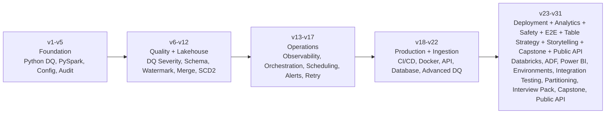

# End-to-End Data Engineering Pipeline Simulator

This is a portfolio-ready, production-style Data Engineering pipeline simulator built across 31 versioned releases.

It demonstrates how customer and reference data can move from source systems into raw landing, Bronze, Silver, Gold, historical, canonical, observability, and downstream MDM-style outputs with production controls such as schema validation, metadata-driven data quality, quarantine handling, watermarking, SCD Type 2, alerting, retry/replay, CI/CD, Docker, Databricks metadata, ADF-style orchestration, Power BI-ready outputs, secret-safe environments, E2E integration testing, partitioning strategy, capstone readiness validation, and public API integration testing.

```text
Current Version: v31.0.0
Final Roadmap Phase: Live Public API Integration Testing Framework
```

---

## Project About

| Area | Details |
|---|---|
| Project name | End-to-End Data Engineering Pipeline Simulator |
| Target roles | Azure Data Engineer, Databricks Data Engineer, PySpark Developer, Big Data Engineer |
| Main purpose | Demonstrate production-style Data Engineering implementation and explanation |
| Real-work mapping | Apexon / IQVIA-style MDM ingestion, DQ, quarantine, canonical modeling, Reltio-style payloads, observability, and release discipline |
| Final phase | V31 public API integration testing with CI-safe mocked automation and optional manual live execution |

See also:

```text
docs/project_about.md
docs/storytelling/project_overview_2_minute.md
docs/storytelling/deep_dive_walkthrough.md
docs/v31_live_public_api_integration_testing_framework.md
```

---

## Interviewer Review Snapshot

| Review Area | What This Project Demonstrates |
|---|---|
| Role alignment | Azure / Databricks / PySpark Data Engineering pipeline design |
| End-to-end system thinking | Source ingestion -> raw landing -> bronze -> silver -> gold -> downstream MDM-style output |
| Production controls | Schema validation, DQ, quarantine, audit, alerting, retry, replay, CI/CD, Docker, environment safety, E2E validation, partition strategy, capstone readiness, public API testing |
| Versioned maturity | The project matured from basic ETL concepts into a production-style capstone with final public API integration support |
| Real-work alignment | Mirrors Apexon / IQVIA-style MDM source ingestion, data quality, canonical modeling, Reltio-style payload generation, release validation, and operational support |

---

## End-to-End Flow

```mermaid
flowchart LR
    A[Source Systems<br/>API / File / Database / Public API] --> B[Raw Landing<br/>JSON / CSV / Tables]
    B --> C[Schema Contracts<br/>Required Fields + Types]
    C --> D[Bronze Layer<br/>Standardization]
    D --> E[Data Quality Framework<br/>Rules + Severity]
    E --> F{Valid?}
    F -- Yes --> G[Silver Layer<br/>Clean + Transformed Data]
    F -- No --> H[Quarantine Layer<br/>Rejected Records]
    G --> I[Gold Layer<br/>Canonical Model]
    I --> J[SCD Type 2<br/>History Tracking]
    J --> K[Reltio-style<br/>JSON Payloads]
    K --> L[Audit + Run Metadata]
    L --> M[Observability Metrics]
    M --> N[Alerts + SLA Monitoring]
    N --> O[Retry / Recovery / Replay]
    O --> P[CI/CD + Release Verification]
    P --> Q[Docker + Databricks / ADF-style Deployment]
    Q --> R[Power BI-ready Outputs]
    R --> S[Secret-safe<br/>Environment Configuration]
    S --> T[Manifest-driven<br/>E2E Integration Testing]
    T --> U[Partitioning + Table<br/>Maintenance Strategy]
    U --> V[Interview + Resume<br/>Storytelling Pack]
    V --> W[Capstone Readiness<br/>Manifest + Validation]
    W --> X[Public API Integration<br/>Mock CI + Manual Live Mode]
```



---

## Versioned Project Maturity



| Version Range | Engineering Maturity Added | What It Proves |
|---|---|---|
| v1 - v5 | Config-driven Python pipeline, PySpark medallion flow, Databricks-style structure, centralized config, audit tracking | Strong foundation and clean project structure |
| v6 - v12 | Severity-based DQ, custom exceptions, schema validation, incremental load, watermarking, merge/upsert, SCD Type 2 | Data quality, reliability, and lakehouse processing depth |
| v13 - v17 | Observability mart, orchestration, job control, scheduling, dependency checks, alerting, SLA monitoring, retry and replay | Operational thinking beyond basic transformation code |
| v18 - v22 | CI/CD hardening, Docker runtime, API ingestion, database ingestion, advanced DQ rule catalog | Production-readiness, testability, and ingestion framework design |
| v23 - v31 | Databricks metadata, ADF simulation, Power BI observability, secret-safe environments, E2E testing, partitioning, storytelling, capstone validation, public API integration | Cloud deployment style, analytics visibility, secure release discipline, system validation, table-layout planning, interview readiness, and final integration maturity |

---

## Real-Work Alignment

| Real Work Pattern | Portfolio Implementation |
|---|---|
| API, file, connector, database, and public source ingestion | Config-driven API/database ingestion plus V31 public API registry |
| Landing to staging transformations | Bronze and Silver processing with schema and DQ checks |
| Data quality failures and quarantine | Severity-based DQ framework with clean/quarantine split |
| Canonical modeling | Gold canonical customer model and Reltio-style JSON payloads |
| Incremental processing | Watermarks, audit logs, retry/recovery, and failure replay |
| Operational monitoring | Observability metrics, alerting, SLA monitoring, Power BI-ready outputs |
| Deployment discipline | Databricks metadata, ADF metadata, Docker, GitHub Actions, release verification |
| Environment safety | Dev/test/prod configs with credential references and `.env.example` placeholders |
| System-level validation | Manifest-driven E2E smoke/full integration gates |
| Performance thinking | Partition columns, clustering columns, target file sizes, and retention windows |
| Interview readiness | Two-minute story, deep-dive walkthrough, resume bullets, mock questions, Apexon/IQVIA mapping |

---

## Project Versions

| Version | Feature |
|---|---|
| v0.0.0 | Project foundation and local repository setup |
| v1.0.0 | Python config-driven DQ pipeline |
| v2.0.0 | PySpark Bronze/Silver/Gold medallion pipeline |
| v3.0.0 | Databricks-style documentation and notebook structure |
| v4.0.0 | Production-style centralized pipeline configuration |
| v5.0.0 | Pipeline audit tracking |
| v6.0.0 | Severity-based DQ failure control |
| v7.0.0 | Custom exceptions and structured error handling |
| v8.0.0 | Schema Validation Framework |
| v9.0.0 | Incremental Load and Watermark Framework |
| v10.0.0 | Delta Lake / Lakehouse Storage Upgrade |
| v11.0.0 | Delta MERGE / Upsert Framework |
| v12.0.0 | SCD Type 2 / Historical Dimension Tracking |
| v13.0.0 | Data Observability + Pipeline Metrics Mart |
| v13.0.1 | Pre-V14 repository review and roadmap handoff cleanup |
| v13.0.2 | Markdown formatting cleanup before V14 |
| v14.0.0 | Pipeline Orchestration + Job Control Framework |
| v15.0.0 | Scheduling, Dependency Management, and Runtime Parameterization |
| v16.0.0 | Pipeline Alerting, Failure Notification, and SLA Monitoring |
| v17.0.0 | Retry Framework, Recovery Handling, and Failure Replay |
| v18.0.0 | CI/CD Hardening, Quality Gates, and Release Automation |
| v19.0.0 | Docker Containerized Local Runtime |
| v20.0.0 | API Ingestion Framework |
| v21.0.0 | Database Ingestion Framework |
| v22.0.0 | Advanced Data Quality Rule Catalog |
| v23.0.0 | Databricks Asset Bundle Style Deployment Structure |
| v23.0.1 | Pre-V24 Professional Repository Cleanup |
| v24.0.0 | Azure Data Factory Orchestration Simulation |
| v25.0.0 | Power BI-Ready Observability Dashboard |
| v25.0.1 | Documentation and Release Gate Alignment |
| v26.0.0 | Secrets, Environments, and Deployment Configuration |
| v27.0.0 | End-to-End Integration Testing Framework |
| v28.0.0 | Performance Optimization and Partitioning Strategy |
| v29.0.0 | Interview, Resume, and Project Storytelling Pack |
| v30.0.0 | Final Production-Ready Capstone Release |
| v31.0.0 | Live Public API Integration Testing Framework |

---

## Key Features

- Python config-driven DQ pipeline
- PySpark medallion architecture
- Bronze, Silver, Gold, Quarantine, and Customer History layers
- Delta Lake-style local storage support
- Config-driven API ingestion framework
- Config-driven database ingestion framework
- V31 public API integration framework
- Mocked CI-safe public API fixtures
- Optional manual live public API execution
- Raw JSON landing and normalized CSV outputs
- Advanced metadata-driven DQ rule catalog
- Schema validation using JSON contracts
- Incremental load using watermark tracking
- Severity-based DQ failure control
- Quarantine handling
- Pipeline audit tracking
- Delta MERGE / Upsert design
- SCD Type 2 history tracking
- Data observability metrics mart
- Power BI-ready observability dashboard exports
- Secret-safe environment and deployment configuration
- Manifest-driven E2E integration testing framework
- Partitioning and table maintenance strategy
- Interview and resume storytelling pack
- Production-readiness capstone manifest
- Alerting and SLA monitoring
- Retry, recovery, and replay handling
- Databricks Asset Bundle-style deployment structure
- Azure Data Factory-style orchestration metadata
- Docker containerized local runtime
- CI/CD quality gates and release verification
- Runtime-output cleanliness validation
- Reltio-style JSON payload generation

---

## Key Configuration and Metadata

```text
.env.example
databricks.yml
resources/customer_medallion_job.yml
azure/adf/pipelines/customer_medallion_adf_pipeline.json
azure/adf/linked_services/ls_databricks_customer_pipeline.json
azure/adf/datasets/customer_landing_metadata.json
dashboards/powerbi/observability_dashboard_schema.json
config/api/customer_api_ingestion_config.json
config/api/live_public_api_sources.json
config/database/customer_database_ingestion_config.json
config/environments/dev.json
config/environments/test.json
config/environments/prod.json
config/partitioning/customer_partition_strategy.json
config/pipeline/local_config.json
config/rules/customer_dq_rules.json
config/rules/advanced_customer_dq_rule_catalog.json
configs/schema_contracts/bronze_customers_schema.json
configs/schema_contracts/silver_customers_schema.json
configs/schema_contracts/live_public_api_schema.json
tests/integration/customer_pipeline_e2e_manifest.json
release/capstone/v30_production_readiness_manifest.json
docs/project_about.md
```

---

## How to Run Locally

Activate virtual environment:

```bash
source .venv/bin/activate
```

Install dependencies:

```bash
python -m pip install -r requirements.txt
```

Run V31 public API registry validation:

```bash
python -m scripts.validate_public_api_registry
```

Run V31 mocked public API integration:

```bash
python -m scripts.live_public_api_integration
```

Run optional manual public API integration only after local endpoint setup:

```bash
python -m scripts.live_public_api_integration --allow-live
```

Run E2E smoke integration gates:

```bash
python -m scripts.run_e2e_integration_tests --mode smoke --run-date 2026-06-23
```

Run full release verification:

```bash
python -m scripts.release_verification --version v31.0.0
```

---

## Validation and Release Gates

Run the full current verification set:

```bash
python -m scripts.validate_python_project
python -m scripts.validate_config_files
python -m scripts.validate_docker_artifacts
python -m scripts.validate_databricks_bundle_structure
python -m scripts.validate_repo_hygiene
python -m scripts.validate_adf_artifacts
python -m scripts.validate_powerbi_dashboard_artifacts
python -m scripts.validate_secret_environment_config
python -m scripts.validate_partition_strategy
python -m scripts.validate_storytelling_pack
python -m scripts.validate_capstone_readiness
python -m scripts.validate_public_api_registry
python -m scripts.live_public_api_integration
python -m scripts.run_e2e_integration_tests --mode smoke --run-date 2026-06-23
python -m scripts.run_e2e_integration_tests --mode full --run-date 2026-06-23
python -m unittest tests.test_v31_public_api_integration
python -m unittest discover tests
python -m scripts.release_verification --version v31.0.0 --skip-real-run --skip-alerting
python -m scripts.validate_runtime_cleanliness
```

Validate release tag safety before tagging:

```bash
python -m scripts.validate_release_tag --version v31.0.0
```

---

## V31 Public API Integration Testing Framework

V31 adds:

```text
config/api/live_public_api_sources.json
configs/schema_contracts/live_public_api_schema.json
data/api/mock_live_countries_response.json
data/api/mock_live_users_response.json
scripts/live_public_api_integration.py
scripts/validate_public_api_registry.py
tests/test_v31_public_api_integration.py
.github/workflows/v31-public-api-integration-ci.yml
docs/v31_live_public_api_integration_testing_framework.md
```

CI uses mocked responses. Manual live execution requires explicit local opt-in.

---

## Documentation

```text
docs/project_about.md
docs/v23_databricks_asset_bundle_structure.md
docs/v23_0_1_pre_v24_professional_cleanup.md
docs/v24_azure_data_factory_orchestration_simulation.md
docs/v25_powerbi_observability_dashboard.md
docs/v25_0_1_docs_release_alignment.md
docs/v26_secrets_environments_deployment_config.md
docs/v27_end_to_end_integration_testing_framework.md
docs/v28_performance_optimization_partitioning_strategy.md
docs/v30_final_production_ready_capstone_release.md
docs/v31_live_public_api_integration_testing_framework.md
docs/storytelling/project_overview_2_minute.md
docs/storytelling/deep_dive_walkthrough.md
docs/storytelling/resume_bullets.md
docs/storytelling/apexon_iqvia_mapping.md
docs/storytelling/mock_interview_questions.md
docs/roadmap/v26_live_public_api_integration_testing.md
```

---

## Skills Demonstrated

```text
Python, SQL-style extraction, PySpark, Delta Lake, Databricks deployment structure,
Azure Data Factory orchestration concepts, Docker, CI/CD, metadata-driven DQ,
watermarking, SCD2, observability, alerting, retry/replay, Power BI-ready reporting,
secret-safe environment configuration, E2E integration testing, partitioning strategy,
interview storytelling, capstone readiness validation, public API integration testing,
Git/GitHub release discipline, and production-style data engineering design.
```

---

## Latest Interview Explanation

```text
This project simulates an end-to-end production-style data engineering platform. It includes API and database ingestion, metadata-driven data quality, medallion processing, Delta-style storage, SCD2 history, observability, alerting, retry/replay, Databricks deployment metadata, ADF orchestration metadata, Docker runtime, CI/CD quality gates, Power BI-ready dashboard exports, secret-safe dev/test/prod environment configuration, manifest-driven E2E integration testing, table partitioning strategy, a validated storytelling pack, capstone readiness validation, and a final public API integration testing framework. V31 keeps CI safe by using mocked public API fixtures while supporting optional manual live endpoint execution for local practice and demonstrations.
```
